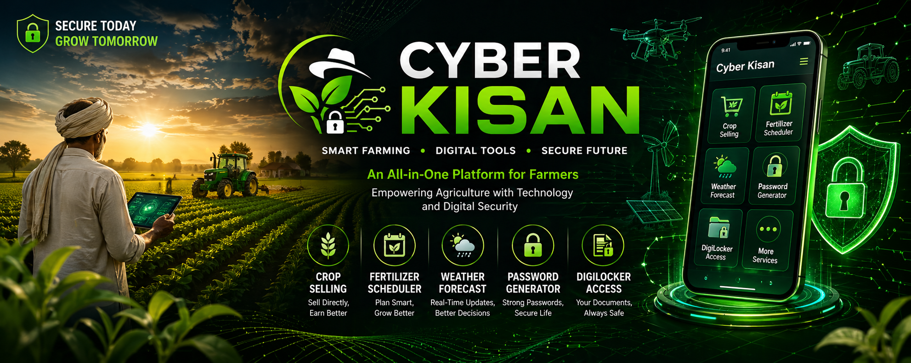

  

<h1 align="center">🌾🚀 Cyber Kisan – Smart Farming & Security App</h1>

<b>Where Farming Meets Cyber Power 💻🌱</b>

---

## 🌐🚀 Live Demo

🔗 https://cyberkisan.netlify.app  

---

## 📖 About the Project
Cyber Kisan is an innovative all-in-one application designed to empower farmers by combining **modern agriculture tools 🌾** with **digital security features 🔐**.  

This platform helps farmers improve productivity, make smarter decisions, and stay **safe in the digital world 🌐**.

---

## ⚡ Features

### 🌾 Crop Selling Platform
- Sell crops directly to buyers 🤝  
- No middlemen → More profit 💰  

### 🌱 Fertilizer Scheduler
- Smart planning for fertilizer usage 📅  
- Boost crop health & yield 🌿  

### 🌦️ Weather Forecast
- Real-time weather updates ☁️  
- Better farming decisions  

### 🔐 Password Generator
- Generate strong & secure passwords 🛡️  
- Protect digital identity  

### 📂 DigiLocker Access
- Store & access important documents 📑  
- Safe, secure & paperless  

---

## 🔐🌐 Cyber Awareness for Farmers

Cyber Kisan is not just a farming app 🌾 — it also focuses on making farmers **digitally aware and secure 🛡️**.

With the increasing use of smartphones, farmers can become targets of **cyber frauds, phishing attacks, fake apps, and scams 🚨**.  
This app spreads awareness and guides users on how to stay safe.

### 🧠 What This Feature Provides:
- Awareness about common cyber crimes ⚠️  
- Safe internet practices 📱  
- Protection of personal & financial data 💳  
- Easy access to trusted cyber resources 🌐  

### 🔗 Useful Cyber Safety Resources:
- 🇮🇳 https://cybercrime.gov.in  
- 🔍 https://haveibeenpwned.com  
- 🔐 https://www.digilocker.gov.in  

---

## 🧭 App Workflow / Architecture

This blueprint illustrates the basic processing and workflow of the Cyber Kisan application.

  

## 🎯 Objective
To bridge the gap between **agriculture 🌾** and **technology 💻**, making farmers more **efficient, independent, and digitally secure**.

---

## 🛠️ Tech Stack
- 📱 Frontend: (Flutter / Android / React)  
- ⚙️ Backend: (Node.js / Firebase)  
- 🌐 APIs: Weather API, Authentication APIs  
- 🗄️ Database: (MongoDB / MySQL / Firebase)  

---

## 🚀 Future Enhancements
- 🤖 AI-based crop recommendations  
- 💳 Online payment integration  
- 🌍 Multi-language support  
- 📢 Government scheme updates  

---

## 👨‍💻 Author
**Priyanshu Jangra**  
💻 Cyber Security Expert | Developer  

---

## 🤝 Contribution
Contributions are welcome!  
Fork 🍴 this repo and submit a PR 🚀  

---

## ⭐ Support
If you like this project, give it a **star ⭐** and share it!

---

## 📜 License
MIT License 📄

## 📖 About the Project
Cyber Kisan is an innovative all-in-one application...

